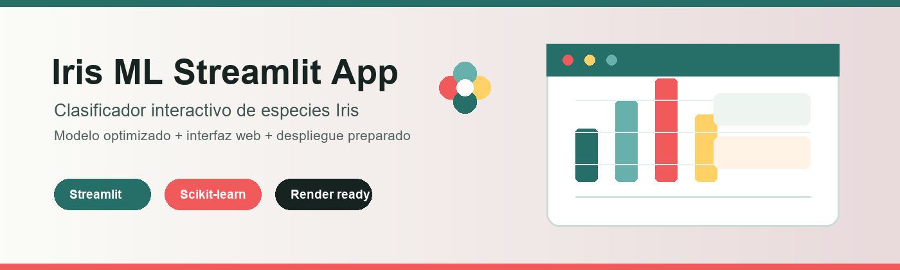

# ML Web Application with Streamlit



**Idioma / Language:** [Español](README.es.md) | English

This project turns an Iris species classifier into an interactive **Streamlit** web application. Users can enter four flower measurements, obtain the predicted Iris species, and review class probabilities.

## Goal

- Reuse a previously trained Machine Learning model.
- Build a Streamlit web interface.
- Display model metrics, probabilities, and dataset information clearly.
- Prepare the repository for Streamlit Community Cloud and Render deployment.

## Dataset

The project uses the **UCI Iris Dataset**, loaded with `sklearn.datasets.load_iris`.

Features:

- `sepal_length_cm`
- `sepal_width_cm`
- `petal_length_cm`
- `petal_width_cm`

Target:

- `species`

## Model

The Machine Learning pipeline uses:

- `StandardScaler`
- `RandomForestClassifier`
- `GridSearchCV` for hyperparameter tuning

Main results:

- Optimized accuracy: `0.933`
- Optimized macro F1: `0.933`

The trained model is saved at:

```text
models/iris_classifier.joblib
```

## Streamlit App

The main application is:

```text
src/app.py
```

The app includes:

- Sliders for botanical measurements.
- Iris species prediction.
- Class probability chart.
- Model metrics.
- Feature importance.
- Dataset preview.

## Project Structure

```text
.
├── .streamlit/config.toml
├── data/
│   ├── raw/iris.csv
│   └── processed/
│       ├── train.csv
│       └── test.csv
├── models/
│   ├── iris_classifier.joblib
│   └── iris_metrics.json
├── reports/figures/
│   ├── feature_importance.png
│   ├── petal_scatter.png
│   ├── species_distribution.png
│   └── streamlit_banner.png
├── src/
│   ├── app.py
│   ├── explore.ipynb
│   ├── train_model.py
│   └── utils.py
├── Procfile
├── render.yaml
└── requirements.txt
```

## Run Locally

Install dependencies:

```bash
pip install -r requirements.txt
```

Train or regenerate the model:

```bash
python src/train_model.py
```

Run the app:

```bash
streamlit run src/app.py
```

## Streamlit Community Cloud

1. Go to [share.streamlit.io](https://share.streamlit.io/).
2. Connect your GitHub account.
3. Select this repository.
4. Use this main file:

```text
src/app.py
```

5. Streamlit will install dependencies from `requirements.txt`.

Streamlit URL:

```text
Pending after deployment.
```

## Render Deployment

This repository includes `render.yaml` and `Procfile`.

Expected configuration:

- Build Command: `pip install -r requirements.txt`
- Start Command: `streamlit run src/app.py --server.port $PORT --server.address 0.0.0.0`

Render URL:

```text
Pending after deployment.
```

## External Resources

- UCI Iris Dataset via scikit-learn.
- Streamlit documentation.
- Render Web Services documentation.
- Streamlit Community Cloud.
